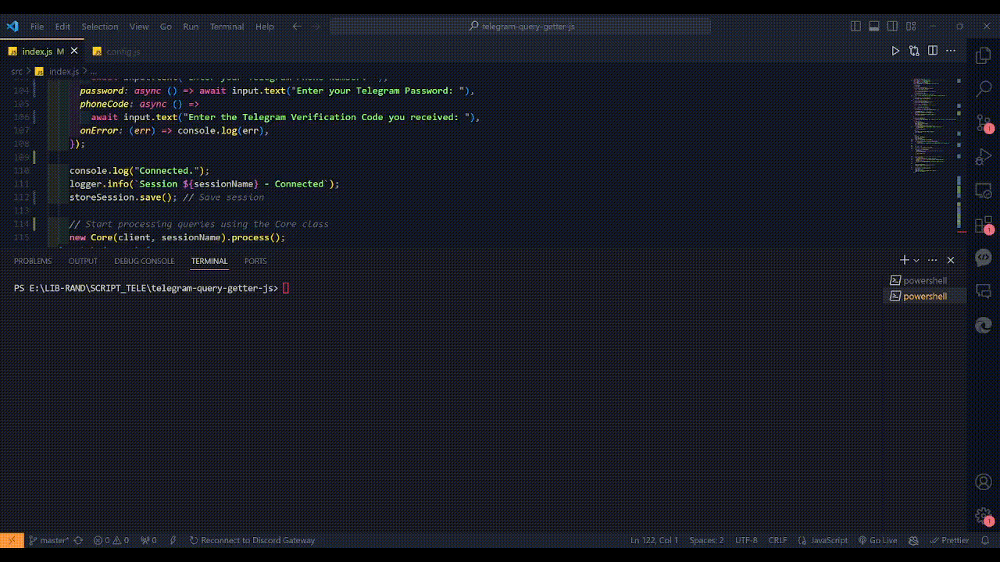

# TELEGRAM QUERY GETTER (NODE JS)

Telegram web apps query getter, to get query data provided by telegram when authenticating to Telegram Web Apps.

## Prerequisite

- Git
- Node JS

## What you need to use this ?

- TELEGRAM_APP_ID & TELEGRAM_APP_HASH Get it from [Here](https://my.telegram.org/auth?to=apps)
- Telegram Bot Username & Telegram Web Apps Url (Or you can use provided list)

## Setup & Configure

1. Clone this Repo and cd
    ```shell
     git clone https://github.com/RyomenRR/telegram-query-getter-js.git
   cd telegram-query-getter-js.git```
   
3. Run ```npm install```
5. Run ```cp config_tmp.js config.js```
   To configure the app, open `nano config.js` and add your telegram app id and hash there
6. Create sessions directory ```mkdir sessions```
7. to start the app run ```npm run start```

## Preview


## Note

you can see `bot_url_list.js` for the example of bot username and url.
